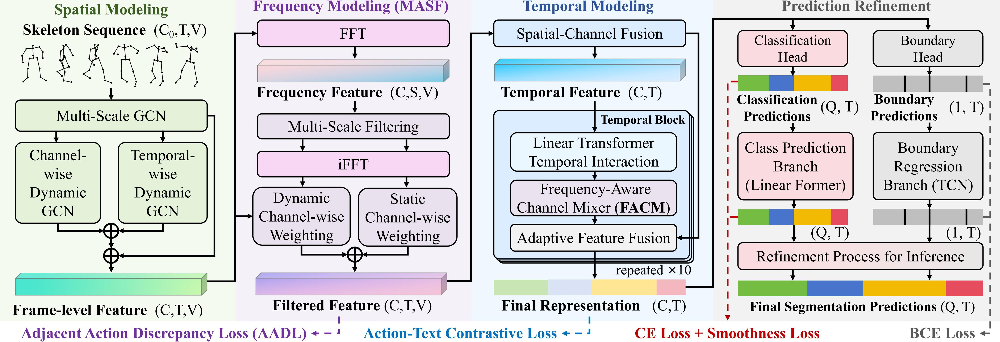
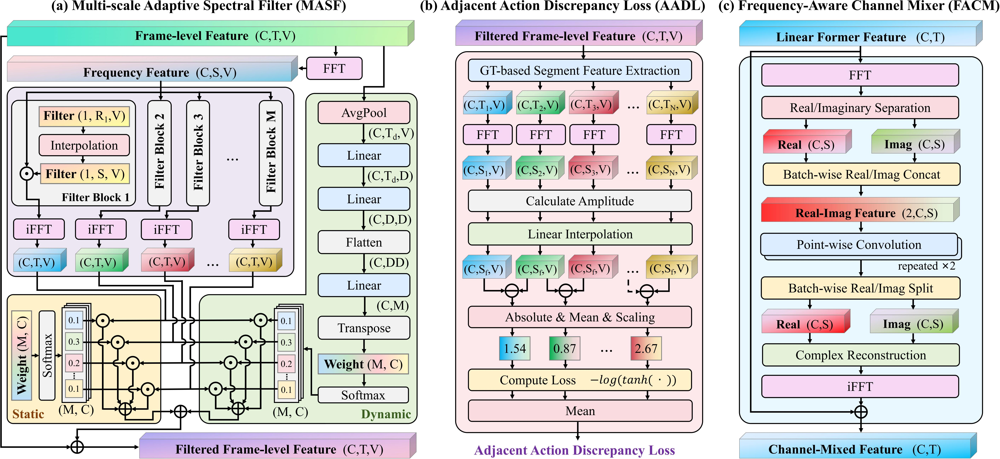

# <p align=center> Spectral Scalpel: Amplifying Adjacent Action Discrepancy via Frequency-Selective Filtering for Skeleton-Based Action Segmentation</p>


> **Abstract:** *Skeleton-based Temporal Action Segmentation (STAS) seeks to densely segment and classify diverse actions within long, untrimmed skeletal motion sequences. However, existing STAS methodologies face challenges of limited inter-class discriminability and blurred segmentation boundaries, primarily due to insufficient distinction of spatio-temporal patterns between adjacent actions. To address these limitations, we propose Spectral Scalpel, a frequency-selective filtering framework aimed at suppressing shared frequency components between adjacent distinct actions while amplifying their action-specific frequencies, thereby enhancing inter-action discrepancies and sharpening transition boundaries. Specifically, Spectral Scalpel employs adaptive multi-scale spectral filters as scalpels to edit frequency spectra, coupled with a self-supervised discrepancy loss between adjacent actions serving as the surgical objective. This design amplifies representational disparities between neighboring actions, effectively mitigating boundary localization ambiguities and categorical confusions. Furthermore, complementing long-term temporal modeling, we introduce a frequency-aware channel mixer to strengthen channel evolution by aggregating spectra across channels. This work presents a novel paradigm for STAS that extends conventional spatio-temporal modeling by incorporating frequency-domain analysis. Extensive experiments on five public datasets demonstrate that Spectral Scalpel achieves state-of-the-art performance.* 

<p align="center">
     <br />
    <em> 
    Figure 1: Overview of the Spectral Scalpel framework..
    </em>
</p>


<p align="center">
     <br />
    <em> 
    Figure 2: Illustration of the three core components.
    </em>
</p>


## Introduction
The PyTorch code serves as the implementation of the paper: "Spectral Scalpel: Amplifying Adjacent Action Discrepancy via Frequency-Selective Filtering for Skeleton-Based Action Segmentation".
The main contributions of this work are summarized as follows:
1) We propose Spectral Scalpel, the first framework to systematically integrate frequency-domain processing into STAS, enhancing inter-class discriminability and sharpening transition boundaries.
2) We design a frequency filtering mechanism comprising the Multi-scale Adaptive Spectral Filter (MASF) and Adjacent Action Discrepancy Loss (AADL), which optimizes spectral discrepancy through self-supervised learning to effectively guide the network in learning discriminative representations.
3) We introduce a Frequency-Aware Channel Mixer (FACM) module that strengthens temporal modeling through spectral interaction among channels, enabling frequency-domain-aware channel evolution.
4) Extensive experiments on five datasets demonstrate that Spectral Scalpel achieves state-of-the-art performance while maintaining competitive computational efficiency.

> * This implementation code encompasses both training `train.py` and evaluation `evaluation.py` procedures.
> * A single GPU (NVIDIA RTX 3090) can perform all the experiments.

## Enviroment
Pytorch == `1.10.1+cu111`, 
torchvision == `0.11.2`, 
python == `3.8.13`, 
CUDA==`11.4`

### Enviroment Setup
Within the newly instantiated virtual environment, execute the following command to install all dependencies listed in the `requirements.txt` file.

``` python
pip install -r requirements.txt
```

## Datasets
All datasets can be downloaded from
[GoogleDrive](https://drive.google.com/drive/folders/1IwiDpf8D2RLzTbF8IB6D6UxCjXmY6J4s?usp=sharing).

**Note**：This cloud drive contains most of the skeleton-based temporal action segmentation datasets, including **PKU-MMD (X-sub)**, **PKU-MMD (X-view)**, **LARa**, **MCFS-130**, and **TCG-15** datasets.


## Preparation

Orgnize the folder in the following structure (**Note**: please check it carefully):

```
|-- config/
|   |-- MCFS-130/
|   |   -- config.yaml
|-- csv/
|-- datasets/
|   |-- LARA/
|   |   |-- features/
|   |   |-- gt_arr/
|   |   |-- gt_boundary_arr/
|   |   |-- splits/
|   |   |-- mapping.txt
|   |-- MCFS-130/
|   |-- PKU-subject/
|   |-- PKU-view/
|   |-- TCG-15/
|-- libs/
|-- pretrained_models
|   |-- MCFS-130/
|   |   |-- best_test_F1_0.5_model.prm
|-- result/
|-- text_embeddings/
|-- utils/
|-- train.py
|-- evaluate.py

```

- `config/`: Parameter configurations for each dataset.  
- `csv/`: Predefined data splits for each dataset.  
- `datasets/`: Raw dataset files.  
- `libs/`: Core model implementation code.  
- `pretrained_models/`: Trained models (results) on each dataset from this work.  
- `result/`: Output directory for training/evaluation results.  
- `text_embedding/`: BERT-generated embeddings for joint and action class text descriptions (per dataset).  
- `train.py` & `evaluate.py`: Main scripts for training and evaluation respectively.  

* The `result` folder and its contents will be automatically generated during code execution (`result` is the default storage path for results).
* Please download the corresponding four datasets and place them in the `datasets` folder. Alternatively, you may modify the `dataset_dir` parameter in the respective dataset's configuration file (e.g., `config/LARA/config.yaml`) to specify your dataset path.


## Get Started

### Training

To train our model on different datasets, use the following command:

```shell
python train.py --dataset PKU-subject --cuda 0
```

Here, `--dataset` can be one of the following: LARA, MCFS-130, PKU-subject, PKU-view, or TCG-15. 
`--cuda` specifies the ID number of the GPU to be used for training. 
Additionally, you can use `--result_path` to specify the output path, which defaults to `./result`.

If you wish to modify other parameters, please update the corresponding dataset's configuration file (e.g., `config/PKU-subject/config.yaml`).


### Evaluation

To evaluate the performance of the results obtained after running the training:

```shell
python evaluate.py --dataset PKU-subject --cuda 0
```

Here, `--dataset` and `--cuda` have the same meaning as in the training command. 
Note that if you specify `--result_path` for evaluation, it should match the `--result_path` used in training to ensure the correct trained model parameters are loaded.

Additionally, we provide pretrained models in `pretrained_models/` for all benchmarked datasets. To evaluate our reported results directly, specify the model path via `--model` parameter:

```shell
python evaluate.py --dataset PKU-subject --cuda 0 --model pretrained_models/PKU-subject/best_test_F1_0.5_model.prm
```


## Acknowledgement
The text embeddings for Action-text Contrastive Loss are generated using [BERT](https://github.com/google-research/bert).
Our experiments were conducted on four publicly available datasets: [PKU-MMD (X-sub)](https://www.icst.pku.edu.cn/struct/Projects/PKUMMD.html), [PKU-MMD (X-view)](https://www.icst.pku.edu.cn/struct/Projects/PKUMMD.html), [LARa](https://zenodo.org/records/3862782), [MCFS-130](https://shenglanliu.github.io/mcfs-dataset/), and [TCG-15](https://github.com/againerju/tcg_recognition).

We sincerely thank the authors for openly sharing their code and datasets, which made this research possible.


## License
This repository is released under the [MIT](https://choosealicense.com/licenses/mit/) License.

